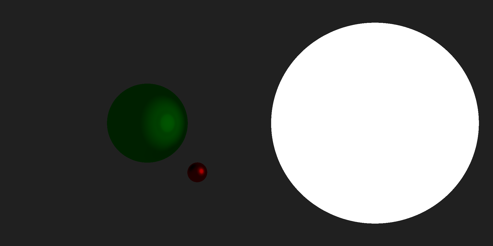

# Raytracer
What I think a raytracer would do, without looking at any references online (though with the help of some friends).

Here's what it currently produces:

To run: `go run main.go` (takes around 1 minute)
To view: open `image.png`

## TODO
- [x] roughness
- [ ] light intensity decay?
- [ ] walls
- [ ] refactor
    - [ ] direction => vector
    - [ ] no pointer methods
- [ ] investigate parallelism
